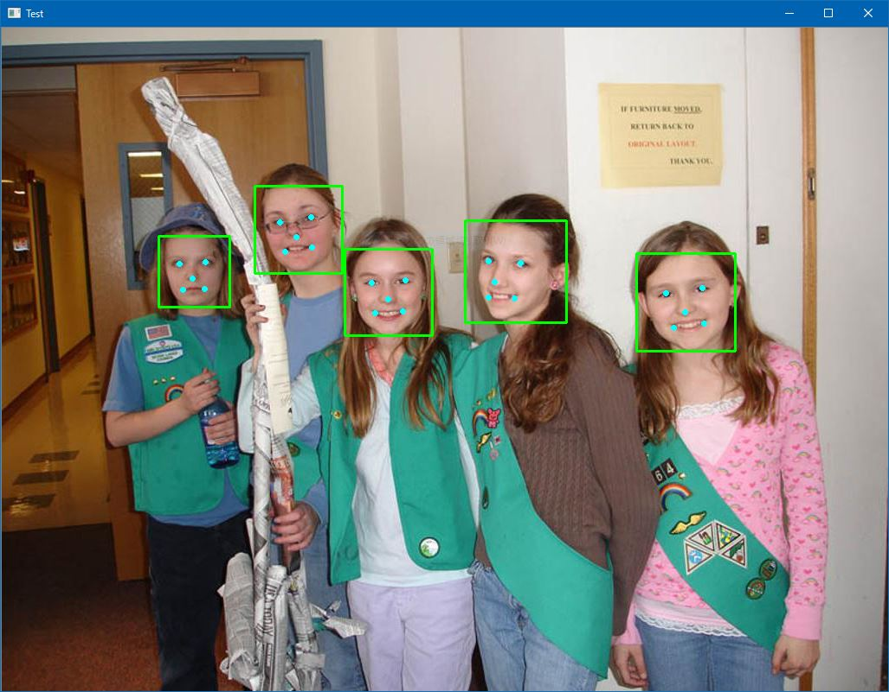

#  CenterFaceDotNet  

C# version of CenterFace
This repository is porting https://github.com/Star-Clouds/CenterFace by C#.

This package supports cross platform, Windows, Linux and MacOSX!!

## Demo

## Dependencies Libraries and Products

#### [CenterFace](https://github.com/Star-Clouds/CenterFace/)

> **License:** Unknown
>
> **Author:** StarClouds
> 
> **Principal Use:** Practical anchor-free face detection and alignment method for edge devices. Main goal of CenterFaceDotNet is what ports CenterFace by C#.

#### [ncnn](https://github.com/Tencent/ncnn/)

> **License:** The BSD 3-Clause License
>
> **Author:** THL A29. Limited, a Tencent company
> 
> **Principal Use:** A high-performance neural network inference framework optimized for the mobile platform in C++. Main goal of NcnnDotNet is what wraps ncnn by C#.

#### [OpenCV](https://opencv.org/)

> **License:** The BSD 3-Clause License
>
> **Author:** Intel Corporation, Willow Garage, Itseez
> 
> **Principal Use:** Uses to read and show image data.

#### [NcnnDotNet](https://github.com/takuya-takeuchi/NcnnDotNet/)

> **License:** The MIT License
>
> **Author:** Takuya Takeuchi
> 
> **Principal Use:** Use ncnn interface via .NET. This library is developed by this owner.

